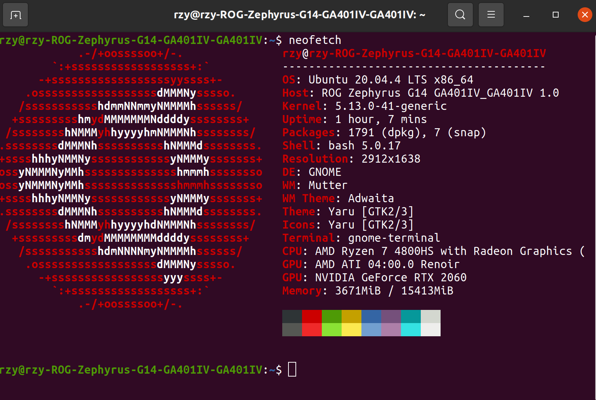

# Linux Summary

## windows双系统干净删除Ubuntu

1. 磁盘管理 删除卷。

2. CMD：

   ```
   diskpart
   list disk
   select disk 0
   list partition
   select partition 1
   assign letter = j
   ```

   

3. 管理员权限打开记事本，删除`J/WFI/Ubuntu`文件夹。

   

4. CMD `remove letter=j`

> 不小心把磁盘变为动态分区咋办（如何转回主分区）？
>
> （大致思路）备份数据，clear disk将整个硬盘转为未分配的空间。
>
> 原本参考的链接找不到了，一个基本思想相似的链接：<https://docs.microsoft.com/en-us/windows-server/storage/disk-management/change-a-dynamic-disk-back-to-a-basic-disk>

##  幻14安装rog-core以及桌面卡顿bug梳理

安装rog-core:

```
git clone https://github.com/flukejones/rog-core.git
cd rog-core/
sudo apt install rustc cargo make libusb-1.0-0-dev libdbus-1-dev llvm libclang-dev
make
sudo make install
```

> 幻14安装ubuntu后桌面卡顿？
>
> + 先使用20.04，22.04有点不适配。
>
> + 查了很多教程（修改SWAP，更新内核，驱动等，反反复复重装了几次），无解（所有驱动都被正确安装，我的台式机双系统没有卡顿的bug）。
>
> + 可能是屏幕的问题，我将我的屏幕设置为FPS模式，打字延迟完全消失，图像仍然存在。
>
> + 将显卡设置为高性能模式，卡顿一定程度缓解。
>
> + 关闭代理软件clash的开机自启动（好像它才是罪魁祸首）。
>
>   附，我的幻14配置：
>
>   

## 安装配置代理软件Clash

> 参考：<https://zhuanlan.zhihu.com/p/430035973>

1. 前往<https://github.com/Dreamacro/clash/releases>下载最新版本的clash.

2. 解压，并修改权限。

   ```
   gunzip clash-linux-amd64-v1.10.6.gz
   chmod +x clash-linux-amd64-v1.10.6
   # 改名
   mv clash-linux-amd64-v1.10.6 clash
   wget -O config.yaml [订阅链接]
   wget -O Country.mmdb https://www.sub-speeder.com/client-download/Country.mmdb
   ```

3. 启动clash

   ```
   ./clash -d .
   ```

4. 设置系统的代理端口：

   <center></center>

5. 访问<https://clash.razord.top/>设置代理节点。