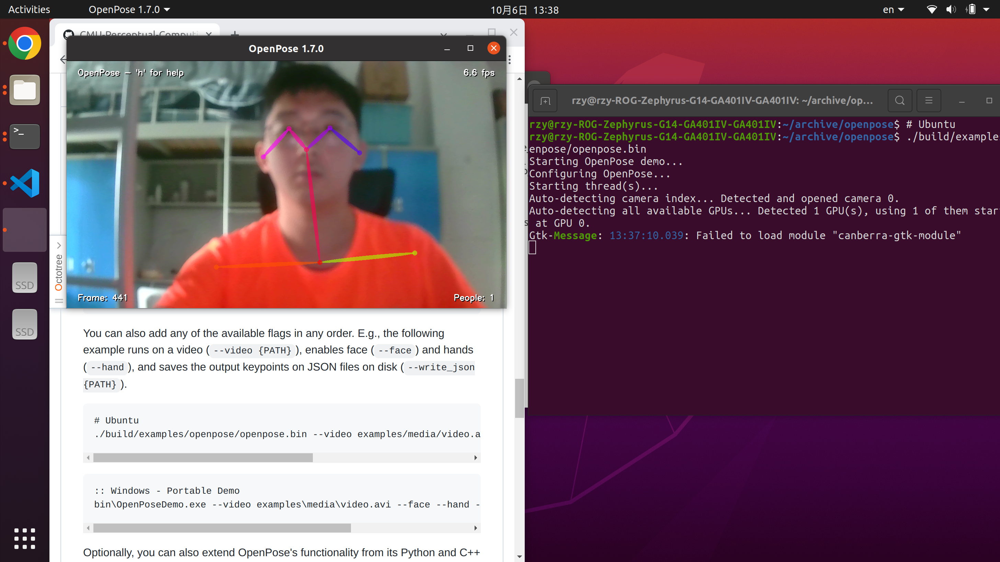

## OpenPose安装及测试环境

+ [OpenPose官网;](https://github.com/CMU-Perceptual-Computing-Lab/openpose)

+ [参考安装教程;](https://yuanze.wang/posts/openpose-on-ubuntu/)
    + **注意OpenPose与Anaconda不兼容。**
+ 测试环境：
    + Ubuntu 20.04和NVIDIA GeForce RTX 2060 with Max-Q D;
    + CUDA10.0和CuDNN7.3.1；
    + Python 3.8.10和OpenCV 3.4.7;

## OpenPose API 测试

```bash
./build/examples/openpose/openpose.bin
```



## OpenPose Python 接口测试

```bash
cd build/examples/tutorial_api_python
python3 01_body_from_image.py
```


